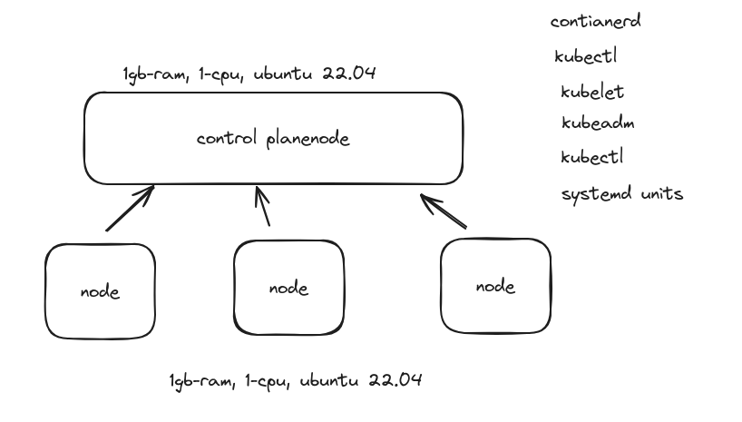

I've documented my setup process for the CKA exam on my Ubuntu system using Hyper-V with nested virtualization. For a detailed guide and insights on my hands-on practice environment, please visit my blog at [hyperv-setup](https://chandu.cc/posts/installhyperv).

# Architecture

